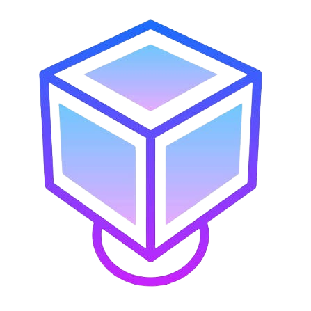

<div align="center">

<p align="center">
  
</p>

# 🚀 VBox

**Launch secure browser workspaces with a single click.**

*A modern frontend for browser-based operating systems, browsers, and developer environments powered by Kasm.*

</div>

---

## ✨ Features

- 🖥️ Launch browser-based operating systems
- 🌐 Open isolated browser workspaces instantly
- ⚡ One-click workspace provisioning
- 🔒 Authentication powered by Clerk
- 📦 MongoDB-backed user management
- 🎨 Modern UI built with Next.js & Tailwind CSS
- 📱 Responsive design across devices
- 🔌 Built for seamless Kasm integration

---

## 🛠 Tech Stack

| Technology | Usage |
|------------|-------|
| Next.js 16 | Framework |
| React 19 | UI |
| TypeScript | Type Safety |
| Tailwind CSS | Styling |
| Clerk | Authentication |
| MongoDB + Mongoose | Database |

---

## 📂 Project Structure

```
app/
components/
lib/
models/
utils/
public/
```

---

## ⚙️ Getting Started

### Clone the repository

```bash
git clone <repo-url>

cd VBox
```

### Install dependencies

```bash
npm install
```

### Configure environment variables

Create a `.env.local`

```env
DATABASE_URI=

DATABASE_PATH=

CLERK_SECRET_KEY=

CLERK_PUBLISHABLE_KEY=
```

### Start the development server

```bash
npm run dev
```

Open:

```
http://localhost:3000
```

---

## 📸 Preview

> Screenshots will be added as the project evolves.

---

## 🗺 Roadmap

- [x] Landing Page
- [x] Authentication
- [ ] Dashboard
- [ ] Workspace Launch
- [ ] Kasm Integration
- [ ] Workspace History
- [ ] User Settings
- [ ] Admin Panel

---

## 🤝 Contributing

Contributions are always welcome.

```bash
Fork → Create Branch → Commit → Push → Pull Request
```

---

## 📄 License

This project is currently open-source.

Choose an appropriate license before production release.

---

<div align="center">

Built with ❤️ using **Next.js**, **Clerk**, and **MongoDB**

</div>